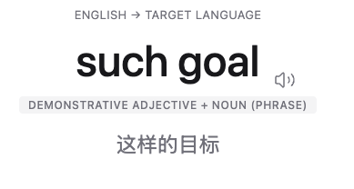

# AI Vocabulary Learning App

An AI-assisted vocabulary learning prototype for turning real reading material into a personal vocabulary system.

一个面向真实阅读场景的 AI 辅助词汇学习原型，目标是把阅读中遇到的生词沉淀为可整理、可复习、可追踪的个人词汇系统。



## Overview

This project explores a complete vocabulary learning workflow:

- capture vocabulary from articles or reading notes
- organize words by collection, language, tag, and learning status
- review words through a dedicated practice flow
- track learning progress with lightweight statistics
- connect the React frontend to a Flask REST backend for vocabulary data

The current version is a portfolio-ready prototype. It contains a polished multi-screen frontend, a small Flask API, and fixed in-memory vocabulary data for local demonstration. Persistence, full CRUD, authentication, and production AI enrichment are planned for later milestones.

## Product Highlights

- **Personal vocabulary workflow**: moves beyond generic word lists and focuses on words collected from real user content.
- **Multi-step import flow**: models the process of pasting text, selecting candidates, and preparing words for review.
- **Review experience**: includes review hub, review session, and review result screens.
- **Collection-first organization**: supports collection detail views and language/category grouping concepts.
- **Frontend-backend separation**: React fetches vocabulary data from a Flask REST service instead of relying only on local mock data.
- **Extensible data shape**: each word includes translation, part of speech, examples, collocations, synonyms, related words, source, and review metadata.

## Current Screens

- Dashboard
- Vocabulary List
- Add Word
- Word Detail
- Import Hub
- Import Steps
- Review Hub
- Review Session
- Review Result
- Collections Hub
- Collection Detail
- Statistics
- Settings

## Tech Stack

| Area | Tools |
| --- | --- |
| Frontend | React, TypeScript, Vite |
| Styling | Tailwind CSS, custom theme tokens |
| UI primitives | Radix-style components |
| Charts | Recharts |
| Icons | Lucide React |
| Backend | Python, Flask, Flask-CORS |
| Data demo | In-memory JSON-style Python data |
| Optional persistence setup | Supabase client configuration |
| Container setup | Docker, Docker Compose |

## Architecture

```text
React + Vite frontend
        |
        | fetch()
        v
Flask REST API
        |
        v
In-memory vocabulary data
```

Key integration files:

- `frontend/src/lib/api.ts` defines the frontend API client and TypeScript data contract.
- `frontend/src/app/screens/VocabularyList.tsx` loads the word list from the backend.
- `frontend/src/app/screens/WordDetail.tsx` loads individual word details when an id is available.
- `backend/app.py` exposes the REST endpoints.
- `backend/data.py` stores the current fixed demo vocabulary data.

## API Endpoints

The Flask backend runs on `http://127.0.0.1:5001` by default.

| Method | Endpoint | Description |
| --- | --- | --- |
| `GET` | `/api/health` | Check backend availability |
| `GET` | `/api/words` | Return all vocabulary items |
| `GET` | `/api/words/<id>` | Return one vocabulary item |

## Local Development

### Prerequisites

- Node.js 18+
- Python 3.10+
- npm

### 1. Configure environment variables

```bash
cp .env.example .env.local
```

Default local values:

```env
VITE_API_BASE_URL=http://127.0.0.1:5001
VITE_SUPABASE_URL=https://YOUR_PROJECT_REF.supabase.co
VITE_SUPABASE_ANON_KEY=YOUR_SUPABASE_ANON_OR_PUBLISHABLE_KEY
```

Supabase variables are prepared for future persistence work. The current demo can run without a connected Supabase project.

### 2. Start the backend

```bash
cd backend
python3 -m venv .venv
source .venv/bin/activate
pip install -r requirements.txt
python app.py
```

### 3. Start the frontend

In another terminal:

```bash
cd frontend
npm install
npm run dev
```

Open the Vite URL shown in the terminal, usually `http://localhost:5173`.

### 4. Build for production

```bash
cd frontend
npm run build
```

## Docker

You can also run the frontend and backend with Docker Compose:

```bash
docker compose up --build
```

Services:

- frontend: `http://localhost:5173`
- backend: `http://localhost:5001`

## Project Status

| Area | Status |
| --- | --- |
| Multi-screen UI prototype | Implemented |
| Flask REST backend | Implemented |
| Frontend API integration | Implemented for vocabulary list and detail |
| Supabase client setup | Prepared |
| Persistent vocabulary CRUD | Planned |
| Spaced repetition algorithm | Planned |
| Real AI enrichment pipeline | Planned |
| Authentication and user accounts | Planned |

## Roadmap

- **P0 Foundation**: routing, shared data contracts, and persistent data baseline.
- **P1 Vocabulary Core**: vocabulary CRUD, collections, tags, search, and filtering.
- **P2 Review Engine**: spaced-repetition scheduling, review queue updates, and review metrics.
- **P3 Product Polish**: real analytics, saved settings, stronger empty/loading/error states, and deployment hardening.

More details are available in [Plan.md](docs/architecture/Plan.md).

## Project Notes

Course-oriented implementation notes and learning logs are kept outside the main README so the GitHub landing page stays focused:

- [Project Log](docs/architecture/project-log/README.md)
- [Flask REST Homework Notes](docs/architecture/project-log/2026-04-20-flask-rest-homework.md)

## Portfolio Note

This repository is maintained as a portfolio project for product thinking, frontend engineering, and basic service integration. Some internal product strategy and design process materials are intentionally not included in the public repository.

## License

This repository is released for portfolio review only under a proprietary All Rights Reserved license.

See [LICENSE](LICENSE) for details.
