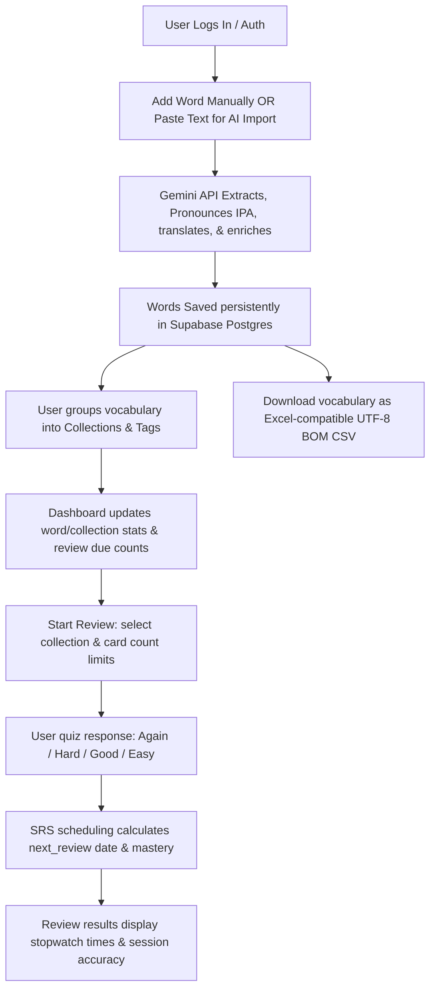

# Voca — AI-Assisted Vocabulary Learning App

An AI-assisted vocabulary learning web app that helps users turn real reading material into structured vocabulary entries, organize them into collections, and review them with a lightweight spaced repetition workflow.

一个面向真实阅读场景的 AI 辅助词汇学习应用，帮助用户把阅读中遇到的生词快速沉淀为可整理、可复习、可追踪的个人系统化词汇。


---

## 🌐 Live Demo

* **Frontend App**: [https://voca118.vercel.app](https://voca118.vercel.app)
* **Backend Service**: Deployed on Google Cloud Run (REST API)

> [!NOTE]
> **Authentication Scoping**: Secure authentication is fully integrated. To access the dashboard and vocabulary tools, please create a new account or log in via the landing portal. All data is scoped and isolated strictly to your user profile.

---

## 🎯 Why I Built This

Generic dictionary listings and static word lists often feel disconnected from active learning. When studying a language, the most memorable words are those encountered in context—in books, articles, news, or movie scripts. 

Voca was designed as a **portfolio-grade prototype** to unify this acquisition loop:
1. **Contextual Capture**: Paste active text and let AI pull relevant candidate words.
2. **AI Enrichment**: Instantly generate IPA pronunciations, translations, collocations, and contextual examples without manual data entry.
3. **Spaced Repetition Practice**: Periodically review stored terms through target-to-native, spelling, and multiple-choice quizzes with scheduling calculated based on active recall performance.

---

## ✨ Key Features

* **AI Text Import & Vocabulary Extraction**: Parses whole articles or paragraphs using the **Gemini API** to identify vocabulary tailored to target learning levels.
* **AI Word Enrichment**: Instantly generates translations, parts of speech, target definitions, standard collocations, and original contextual examples.
* **IPA Phonetic Transcription Support**: Fully supports standard IPA phonetics (e.g., `/ˈtrɪɡər/`) with automatic AI retrieval and manual inline editing overlays.
* **Dynamic Search & Filtering**: Advanced client-side vocabulary selectors filtering items by language, tags, or mastery levels.
* **Collection-Based Management**: Organize vocabularies into distinct subjects or texts. Safe collection deletion prompts ensure child vocabulary relations are never silently orphaned.
* **Custom Spaced Repetition Queue**: Select and limit review cards by collection and session count (e.g., 5, 10, 20, 50, all).
* **Recall-Based Spaced Repetition (SRS)**: Employs a scheduling algorithm updating intervals and mastery levels depending on recall feedback (`Again`, `Hard`, `Good`, `Easy`).
* **Active Session Performance Metrics**: Tracks user stats (stopwatch timer, correct/incorrect ratio, and accuracy percentage) and maps them onto the completion results screen.
* **Excel-Compatible CSV Export**: Supports instant download of vocabulary lists containing IPA characters prefixed with the Unicode UTF-8 BOM (`\ufeff`) to prevent character encoding issues.
* **Real Dashboard Analytics**: Displays actual metrics (due review counts, active learning streaks, collection totals, and recently added words) scoped to the authenticated user.
* **Secure Database Persistence**: Integrated **Supabase Auth** and **Postgres RLS (Row Level Security)** to guarantee total private data isolation.

---

## 💻 Tech Stack

| Component | Technology |
| --- | --- |
| **Frontend** | React, TypeScript, Vite, Tailwind CSS, Lucide Icons, Recharts |
| **Backend** | Python, Flask, Flask-CORS |
| **Database & Auth** | Supabase Postgres, Supabase Auth |
| **AI Services** | Gemini API (Google Generative AI) |
| **Deployment** | Vercel (Frontend), Google Cloud Run (Backend API) |
| **DevOps & Local** | Docker, Docker Compose, Git |

---

## 🏛️ System Architecture

```text
       React/Vite Frontend (Vercel)
                     |
                     | HTTPS + Bearer JWT Token
                     v
      Flask REST API (Google Cloud Run)
                     |
         +-----------+-----------+
         |                       |
         v                       v
 Supabase Client            Gemini API
(Auth, RLS, Postgres)     (Text Extraction & Enrichment)
```

* **JWT Verification**: The Flask backend operates on stateless bearer authentication. When a user requests data, the backend forwards the JWT payload to the Supabase Client, which enforces exact Row Level Security (RLS) filters on the Postgres database. No user can read or modify another user's vocabulary rows.

---

## 🔄 Main Workflow



---

## 📡 API Overview

Backend REST blueprint endpoints:

### Auth & Connection
* `GET /api/health`: Standard backend health checking return.

### Vocabulary Management
* `GET /api/words`: Retrieves all words for the user (supports optional `collection_id` filtering).
* `GET /api/words/<id>`: Retrieves individual word card detail.
* `POST /api/words`: Inserts a newly enriched vocabulary item along with sub-relations (examples, collocations, tags).
* `PUT /api/words/<id>`: Updates word content or changes learning mastery parameters.
* `DELETE /api/words/<id>`: Deletes a vocabulary word.

### Collection Management
* `GET /api/collections`: Retrieves all collections created by the user.
* `POST /api/collections`: Creates a new collection container.
* `DELETE /api/collections/<id>`: Safely deletes a collection.

### AI Engine
* `POST /api/ai/enrich`: Enriches a single word string using the Gemini model.
* `POST /api/import/analyze`: Extracts candidates and definitions from user's pasted reading texts.

### Spaced Repetition (SRS)
* `GET /api/review/queue`: Pulls learning items due for practice based on scheduling intervals.
* `POST /api/review/answer`: Submits recall results (`again`, `hard`, `good`, `easy`) to update SRS intervals.

### Statistics & Export
* `GET /api/stats`: Collects aggregate counts for dashboard metrics and progress charts.
* `GET /api/export/vocabulary`: Generates structured data exports (supports JSON or UTF-8 BOM CSV formatting).

---

## 🛠️ Local Development

### Prerequisites
* Node.js 18+
* Python 3.10+
* Docker & Docker Compose (Recommended)

### Using Docker Compose (Fastest Setup)
Ensure you create a local configuration `.env` file first.

1. Spin up the entire multi-container local stack:
   ```bash
   docker compose up --build
   ```
2. Access the active local interfaces:
   * **Frontend Dev Server**: [http://localhost:3000](http://localhost:3000)
   * **Backend Dev REST Server**: [http://localhost:5001](http://localhost:5001)

### Required Environment Variables
Configure these variables in your environment or files:

```env
# Backend Environment Settings
SUPABASE_URL=https://your-supabase-ref.supabase.co
SUPABASE_ANON_KEY=your-supabase-anon-key
GEMINI_API_KEY=your-gemini-api-key
GEMINI_MODEL=gemini-1.5-flash
FRONTEND_ORIGIN=http://localhost:3000

# Frontend Environment Settings
VITE_API_BASE_URL=http://localhost:5001
VITE_SUPABASE_URL=https://your-supabase-ref.supabase.co
VITE_SUPABASE_ANON_KEY=your-supabase-anon-key
```

---

## 📈 Project Status

| Milestone Area | Feature / Pipeline | Status |
| --- | --- | --- |
| **Authentication** | Supabase Auth login, session refreshing, token-based state | **Implemented** |
| **Persistence** | Row-scoped PostgreSQL storage, secure transactions | **Implemented** |
| **AI Enrichment** | Gemini structured prompting, bulk parsing, normalizers | **Implemented** |
| **Spaced Repetition** | Due queues, interval tracking, performance scheduling | **Implemented** |
| **CSV Export** | Excel character compatibility, BOM prefix, custom headers | **Implemented** |
| **Phonetics** | Nullable IPA columns, badges, manual overlay forms | **Implemented** |
| **Deployments** | Vercel Static Hosting, GCP Cloud Run Docker Container | **Implemented** |
| **Refinement** | Custom SRS formulas, Mobile optimization, Anki presets | *In Progress / Planned* |

---

## 🎓 What I Learned

Building Voca provided highly practical engineering insights:
* **Stateless Authenticated REST Flows**: Orchestrated secure JWT credential propagation from a React client to a Python/Flask resource server, integrating auto-refresh handlers to seamlessly handle near-expiration tokens.
* **Database Scoped Access Guidelines**: Leveraged Row Level Security (RLS) in PostgreSQL, designing DB schemas where row queries implicitly respect authorization structures.
* **Deterministic Structured LLM Outputs**: Crafted strict system prompts, JSON templates, and custom normalizers (`sanitize_ipa`) to extract clean, consistent representations from Gemini Generative AI models.
* **Excel Mojibake Debugging**: Investigated and resolved text corruption anomalies in standard Excel CSV renders by prefixing all outgoing CSV buffers with the Unicode Byte Order Mark (`\ufeff`).
* **Micro-services Orchestration**: Formulated development environments utilizing multiple Docker containers bound dynamically via bridge networks and CORS configurations, mirroring Cloud production setups locally.

---

## 📄 License

This repository is released for portfolio review only under a proprietary All Rights Reserved license.

See [LICENSE](LICENSE) for details.
